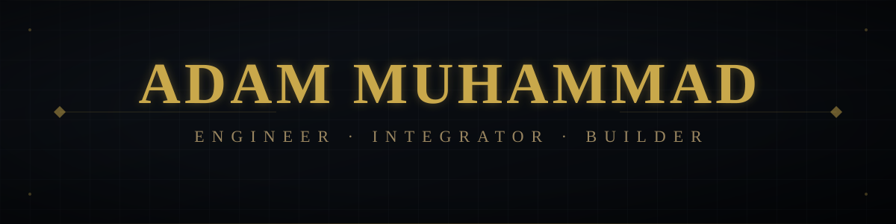

<div align="center">



<p align="center">
  
</p>

<br/>

[](https://dummjo.dev)&nbsp;
[](mailto:1437yb@gmail.com)&nbsp;
[](https://github.com/dummJo)

</div>

<br/>

---


<div align="center">
  <picture>
    <source media="(prefers-color-scheme: dark)" srcset="https://raw.githubusercontent.com/dummJo/dummJo/output/pacman-contribution-graph-dark.svg">
    <source media="(prefers-color-scheme: light)" srcset="https://raw.githubusercontent.com/dummJo/dummJo/output/pacman-contribution-graph.svg">
    
  </picture>
</div>

<br/>

---


<div align="center">
  <table border="0">
    <tr>
      <td align="center" style="padding: 10px;">
        
      </td>
      <td align="center" style="padding: 10px;">
        
      </td>
    </tr>
    <tr>
      <td align="center" colspan="2" style="padding: 10px;">
        
      </td>
    </tr>
  </table>
</div>

<div align="right">
  
</div>

<br/>

---


<div align="center">
  
</div>

<br/>


```text
Variable Speed Drives    ·  ABB (ACS580, ACS880)
Crane Control            ·  Anti-Sway · Load Weighing · (N5050)
Power Quality            ·  THD Analysis · Active Harmonic Filters
PLC Programming          ·  ABB · Siemens ·
SCADA & IoT              ·  Remote Monitoring · IEC Safety
```

<br/>

---


| Year | Project | Focus |
|:----:|---------|-------|
| 2022– | **Crane Automation** — ABB ACS880 + N5050 | Caterpillar Batam Industrial Corridor |
| 2025 | **n8n Operations Automation** | Internal Workflow Layer (LLM) |
| 2024– | **AI & Automation Tools** | TypeScript · LLM Integration |
| ∞ | **Power Quality Remediation** | Active Filters · THD Analysis |
| 2023– | **System Integration** | F&B · Industrial · |

<br/>

---


```text
2018  ·  Casio Manufacturing internship — Nakhon Ratchasima, Thailand
2019  ·  Electrical field engineer — industrial sites across Java
2020  ·  First solo VSD commissioning — ABB ACQ580
2022  ·  First ABB N5050 Crane deployment — Cilegon
2024  ·  ABB Channel Partner Expert Day — Shanghai
2025  ·  Presales Engineer & System Integrator — PTTS
```

<br/>

---

<div align="center">

&nbsp;
&nbsp;
&nbsp;


<br/>


</div>
